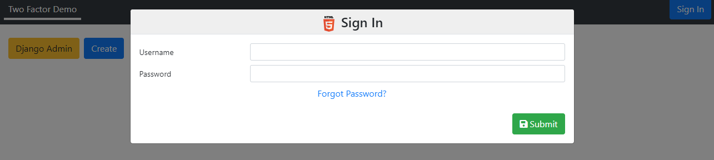

# django-modal-2fa

Drop-in two-factor authentication for Django, presented through Bootstrap modals
(via [django-nested-modals](https://pypi.org/project/django-nested-modals/)).
It replaces the default admin login and adds TOTP, WebAuthn, trusted devices,
brute-force lockout, email invites, and optional "Sign in with Microsoft".

* **TOTP** – authenticator apps (Google Authenticator, Authy, etc.) with an on-screen QR code
* **WebAuthn / FIDO2** – Windows Hello, Face ID / Touch ID, YubiKeys and other passkeys
* **Trusted devices** – an optional cookie to skip 2FA on a named device (the key rotates on each use, so a copied cookie stops working)
* **Lockout** – throttle repeated failures by username and by IP (proxy-aware)
* **Microsoft / Entra sign-in** – optional single-tenant SSO, off unless configured
* **User onboarding** – email invitations to set a password, plus a forgotten-password reset flow
* **Customisable** – restyle every modal and override behaviour from one class

## Requirements

* Python ≥ 3.8
* Django ≥ 4.2
* Installed automatically: `django-nested-modals`, `django-otp`, `qrcode`, `webauthn`

## Installation

    pip install django-modal-2fa

For the optional Microsoft sign-in, install the extra (pulls in `msal`):

    pip install "django-modal-2fa[microsoft]"

### Settings

    from modal_2fa.settings_helper import modal_2fa_apps_admin

    INSTALLED_APPS += [
        *modal_2fa_apps_admin,      # adds django_otp + plugins, modal_2fa, and the 2FA admin
    ]

    OTP_TOTP_ISSUER = 'My App'                                   # label shown in authenticator apps
    AUTHENTICATION_BACKENDS = ['modal_2fa.auth.CookieBackend']
    LOGIN_URL = '/auth/login/'
    LOGOUT_REDIRECT_URL = '/auth/login/'

    WEBAUTHN_RP_ID = 'example.com'    # your domain; use 'localhost' for development
    WEBAUTHN_RP_NAME = 'My App'       # optional; shown by the authenticator

> **Remove `'django.contrib.admin'` from `INSTALLED_APPS`.** `modal_2fa_apps_admin`
> swaps in a 2FA-protected admin site in its place. (If you don't use the Django
> admin, use `modal_2fa_apps` instead, which omits the admin replacement.)

WebAuthn requires a secure context, so register/authenticate over HTTPS in
production (`localhost` is exempt for development).

### URLs

    from modal_2fa.utils import get_custom_auth

    urlpatterns += [
        path('', include(get_custom_auth().paths(include_admin=True))),
    ]

All routes mount under `auth/` with the `auth` namespace — reverse them as
`'auth:login'`, `'auth:auth_2fa'`, `'auth:user_devices'`, etc. Pass
`include_admin=False` to leave out the bundled user-admin modal.

## Authentication flow

1. The user submits credentials to `ModalLoginView`, verified by `CookieBackend`.
2. If a valid trusted-device cookie is present → log in directly.
3. Else if the user has no TOTP device and 2FA is optional for them → log in directly.
4. Otherwise the username is parked in the session and the 2FA modal opens.
5. `Modal2FA` verifies a TOTP code or a WebAuthn credential, then completes login.
6. The user may optionally name and trust the device to skip 2FA next time.

## Lockout settings (optional)

Repeated failures are throttled per username and per IP. Defaults shown:

| Setting | Default | Meaning |
|---|---|---|
| `AUTHENTICATION_USER_FAILED_ATTEMPTS` | `10` | Failures before a username is locked |
| `AUTHENTICATION_IP_FAILED_ATTEMPTS` | `20` | Failures before an IP is locked |
| `AUTHENTICATION_LOCKOUT_SECONDS` | `30` | Lockout duration once the threshold is hit |

Clear expired rows periodically with the bundled command:

    python manage.py clear_failed_logins

### Behind a reverse proxy

IP-based lockout needs the real client IP. Behind a proxy, Django's `REMOTE_ADDR`
is the proxy's address, so set the number of trusted proxy hops and the client IP
is read (spoof-safely) from `X-Forwarded-For`:

    AUTHENTICATION_TRUSTED_PROXY_COUNT = 1   # single edge proxy, e.g. Traefik / nginx
    # AUTHENTICATION_TRUSTED_PROXY_COUNT = 2 # a CDN/LB in front of the proxy, e.g. Cloudflare → Traefik

Default is `0` (no proxy — `REMOTE_ADDR` is used and `X-Forwarded-For` is ignored,
since it would otherwise be client-spoofable). `BEHIND_REVERSE_PROXY = True` is
accepted as a legacy alias for a count of `1`.

## Optional: Sign in with Microsoft / Entra

Add the routes and login button automatically by configuring an Entra (Azure AD)
app registration. The feature stays dormant until all three values are present,
and `msal` is only imported when used.

    MS_CLIENT_ID = '...'          # Application (client) ID
    MS_TENANT_ID = '...'          # Directory (tenant) ID — single-tenant gate
    MS_CLIENT_SECRET = '...'      # a client secret value — keep this out of source control
    # MS_REDIRECT_URI = 'https://example.com/auth/microsoft/redirect'  # optional; built from the request if omitted

Sign-in is restricted to the configured tenant; by default only tenant **members**
are admitted (B2B guests are turned away). A Microsoft sign-in counts as the second
factor only when the ID token proves recent MFA (`amr` + fresh `auth_time`);
otherwise the user still completes the normal TOTP/WebAuthn step. All of this is
overridable — see `MicrosoftCustomiseMixin` (`microsoft_allowed`, `microsoft_user`,
`microsoft_satisfies_2fa`, …).

## Customisation

Point `AUTHENTICATION_CUSTOMISATION` at a subclass of `CustomiseAuth`:

    # settings.py
    AUTHENTICATION_CUSTOMISATION = 'myapp.auth.MyCustomise'

    # myapp/auth.py
    from modal_2fa.customise import CustomiseAuth

    class MyCustomise(CustomiseAuth):

        @staticmethod
        def user_2fa_optional(user):
            return not user.is_staff          # force 2FA for staff

        @staticmethod
        def allowed_remember(user):
            return True                       # offer "remember this device"?

        @staticmethod
        def max_cookies(user):
            return 2                          # trusted devices per user

        @staticmethod
        def customise_view(view):
            view.size = 'md'                  # restyle any auth modal

Common hooks: `user_2fa_optional`, `allowed_remember`, `max_cookies`,
`customise_view`, `override_views` (swap any URL→view mapping), and the email
template attributes for invitations and password resets.

## Adding the user menu

Inject the signed-in-user dropdown (2FA management, authorised devices, logout)
into any view's menu:

    from modal_2fa.menus import add_auth_menu

    def setup_menu(self):
        super().setup_menu()
        add_auth_menu(self)

## Development

A Dockerised demo project lives in `django_examples/`:

    docker-compose up                                              # Django on :8010 + Redis + Celery
    docker-compose exec django_2fa python manage.py migrate
    docker-compose exec django_2fa python manage.py test

For HTTPS (needed to exercise WebAuthn locally), uncomment the `runserver_plus`
line in `docker-compose.yaml` and supply `cert.pem` / `key.pem`.

## License

MIT — see [LICENSE](LICENSE).
