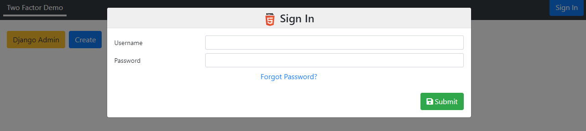

Adds to Django's authentication with 2FA option

* 2FA with Authenticator app using TOTP
* Use WebAuthn with Windows Hello, Face ID, Yubikey etc
* Lock out by ip and username for too many failed attempts
* Customisable Bootstrap 4 Modal interface with django-nested-modals
* Cookie option to bypass 2FA (changing key to prevent copying of cookies)
* Invite users by email to setup an account
* Forgotten password function to email reset link

## Installation

### settings

    from modal_2fa.settings_helper import modal_2fa_apps_admin
    INSTALLED_APPS += [
        *modal_2fa_apps_admin,
    ]
    
    OTP_TOTP_ISSUER = '**appname**'
    AUTHENTICATION_BACKENDS = ['modal_2fa.auth.CookieBackend']        
    LOGIN_URL ='/auth/login/'
    LOGOUT_REDIRECT_URL = '/auth/login'

**remove** 
    ``'django.contrib.auth'``
from INSTALLED_APPS

### urls

    from modal_2fa.utils import get_custom_auth
    
    urlpatterns += [
        path('', include(get_custom_auth().paths(include_admin=True))),    
    ]
